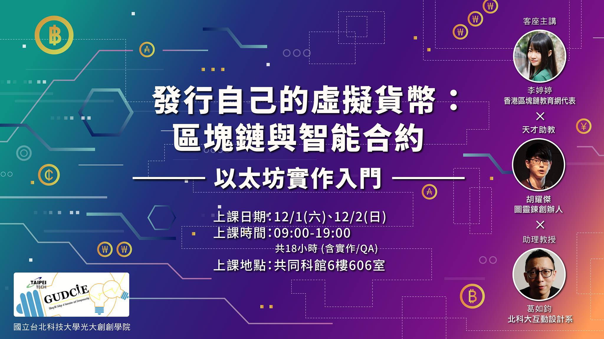
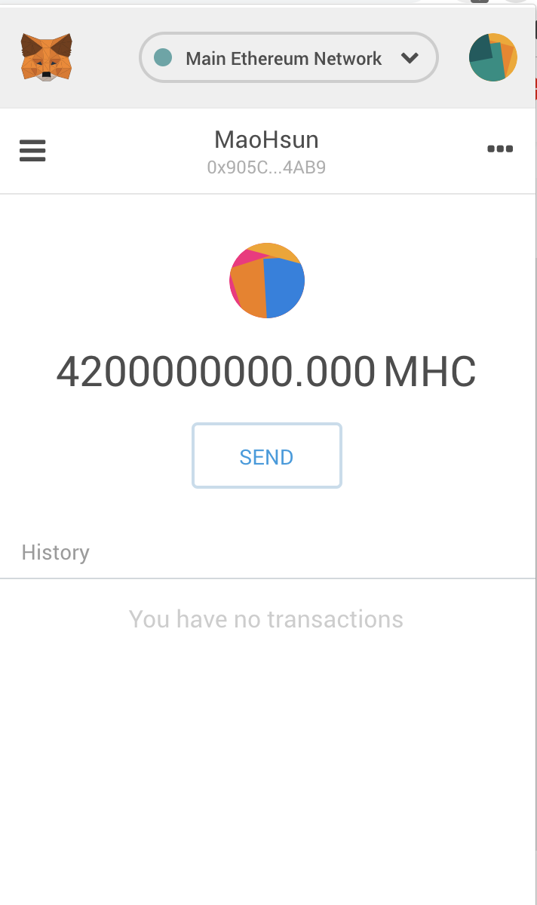

# smart_contract_workshop
This project includes resources of workshop which was organized by [0x1Academy](https://pub.bitrabbit.com/zh-tw/science).

## Resources
下面列出了workshop上練習的smart contract，並且加上了我的中文註解

想了解更多範例請參考: [https://github.com/BlockchainEduNet-HK/smart-contract-repo](https://github.com/BlockchainEduNet-HK/smart-contract-repo)

Notes | Description
-- | --
01 | --
02 | --

Smart Contract | Description
-- | --
[01_Storage.sol](https://github.com/john850512/smart_contract/blob/master/code_practice/01_Storage.sol) | 第一個智能合約，取得區塊鏈上的資訊
[02_Counter.sol](https://github.com/john850512/smart_contract/blob/master/code_practice/02_Counter.sol) | 第二個智能合約，對區塊鏈上的資訊做運算
[03_SafeCounter.sol](https://github.com/john850512/smart_contract/blob/master/code_practice/03_SafeCounter.sol) | 第三個智能合約，對區塊鏈上的資訊做安全運算
[04_Random.sol](https://github.com/john850512/smart_contract/blob/master/code_practice/04_Random.sol) | 第四個智能合約，取得一個假亂數
[05_Token.sol](https://github.com/john850512/smart_contract/blob/master/code_practice/05_Token.sol) | 第五個智能合約，建立一個發幣合約

## The suggestive setup list
- [Setup List for Smart Contract Development](https://gist.github.com/yhuag/5d8ee2fd46baff47edc923134048481c)

## MHC?
A virtual currency which named **MaoHsunCoin(MHC)**, was published on Main Ethernum Network, Congrats!

## How to get MHC?
if you want to get MHC, just create issue or use other way to contact me:)
